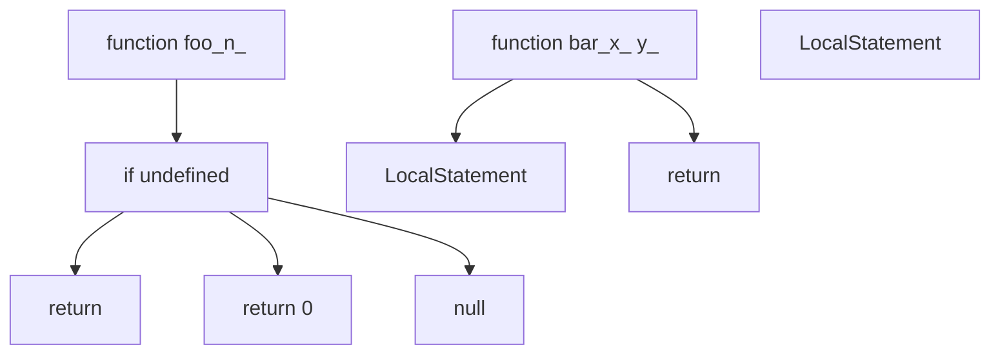

```mermaid
graph TD;
  node0[function foo_n_];
  node1[if undefined];
  node2[return ];
  node3[return 0];
  node4[function bar_x_ y_];
  node5[LocalStatement];
  node6[return ];
  node7[LocalStatement];
  node0-->node1;
  node1-->node2;
  node1-->node3;
  node1-->null;
  node4-->node5;
  node4-->node6;
```